  

I'm a computer science student working mostly in Python, on machine learning systems that have to make a call about something real: is this traffic hostile, should this identity get access, what is this hand signing. The part I care about is the last mile — getting a model out of a notebook and into something a person can actually use and question.

Right now I'm going deeper on the modern GenAI stack (RAG, agents, LangChain) and looking for projects where that work lands somewhere useful.

### What I'm building

| Project | What it does |
|:--|:--|
| [**Sign language detection**](https://github.com/YashikaB-1/sign-language-detection) | Reads hand signs from video and turns them into text. Computer vision, Python. |
| [**Elevator button detection**](https://github.com/YashikaB-1/elevator-button-detection) | Locates and labels elevator panel buttons — the perception piece assistive robots need to ride a lift. |
| [**Permguard**](https://github.com/YashikaB-1/Permguard) | Scores how risky an identity's access request is, and shows which factors drove the score. |
| [**Network intrusion detection**](https://github.com/YashikaB-1/Network-intrusion-detection-system) | Classifies network traffic as benign or attack, with the feature analysis worked through in notebooks. |
| [**APT detection**](https://github.com/YashikaB-1/Advanced-persistent-threats-detection) | Targets the slow, quiet intrusions that stay resident instead of tripping a single alarm. |
| [**Recruitment intelligence engine**](https://github.com/YashikaB-1/Recruitment-intelligence-engine) | Parses resumes, ranks candidates against a role, and explains each match score. |

[All repositories](https://github.com/YashikaB-1?tab=repositories)

### Tools I reach for

  
  
  
  
  
  

  
  
  
  
  
  

### Activity

  
  

### Reach me

